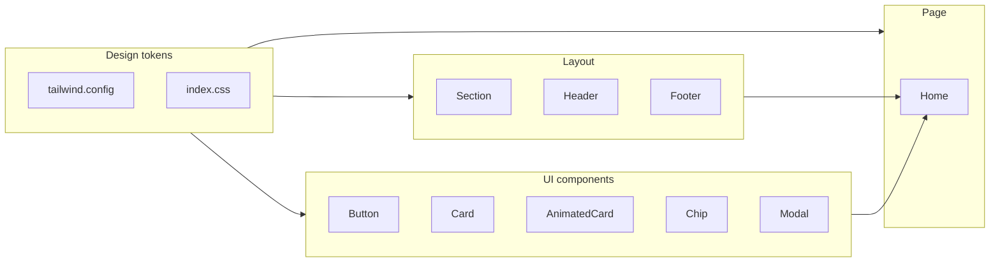

# Enlayer.ai UI/UX Enhancement Plan

## Current state

- **Stack:** React 19, TypeScript, Vite, Tailwind v4, Framer Motion, Lucide icons.
- **Colors:** Primary `#FF7A00`, graphite/slate text, light background `#F8FAFC`.
- **Motion:** Framer Motion (fadeInUp, stagger, card hover, parallax, GradientBlob); minimal CSS transitions.
- **Structure:** Single landing (`[pages/Home.tsx](pages/Home.tsx)`), `[Header](components/layout/Header.tsx)`, `[Footer](components/layout/Footer.tsx)`, shared UI in `[components/ui/](components/ui/)`.

---

## Design direction (current trends)

- **Gradients:** Animated or subtle gradient meshes in hero/backgrounds; gradient text and accent borders.
- **Glassmorphism:** Frosted nav bar, card surfaces with `backdrop-blur` and soft borders.
- **Motion:** CSS keyframe animations for gradients/shimmer; Framer for scroll and hover; reduced-motion respected.
- **Visual hierarchy:** Clear section contrast (alternating soft gradient vs white), generous spacing, consistent radius and shadows.
- **Polish:** Smooth transitions on interactive elements (buttons, links, chips, cards); subtle hover/focus states.

---

## 1. Design tokens and global styles

**File: `[tailwind.config.js](tailwind.config.js)`**

- Add **gradient** definitions (e.g. `gradient-hero`, `gradient-mesh`, `gradient-cta`) using primary/orange/amber and soft complementary colors.
- Extend **animation** and **keyframes**: e.g. `gradient-shift`, `shimmer`, `float`, `fade-in-up` (for Modal and reuse).
- Add **boxShadow** variants: `glow-primary`, `glow-soft`, `card-hover` for consistent depth.
- Optionally add a second font (e.g. display font for headings) and `fontFamily` extension.

**File: `[index.css](index.css)`**

- Define **CSS custom properties** for brand colors and gradient stops so gradients stay consistent.
- Add **keyframes**: `gradient-shift` (background-position or hue), `shimmer` (optional for buttons/cards), `fade-in-up` (opacity + translateY) so `animate-fade-in-up` used in Modal works.
- Add **utility classes** for reusable gradient backgrounds (e.g. `.bg-gradient-mesh`, `.text-gradient-primary`) with optional animation.
- Keep `scroll-behavior: smooth`; add base transition for `color`/`background` where it helps (e.g. `a`, `.transition-smooth`).
- Ensure **reduced motion**: use `@media (prefers-reduced-motion: reduce)` to disable or shorten keyframe animations.

---

## 2. Header

**File: `[components/layout/Header.tsx](components/layout/Header.tsx)`**

- **Glassmorphism when scrolled:** Stronger `backdrop-blur`, light border, subtle `bg-white/80` or gradient strip at bottom.
- **Logo:** Optional subtle gradient on the logo mark (e.g. from primary to amber) or soft glow on hover.
- **Nav links:** Smooth `transition-colors`; optional gradient underline or bottom border on hover/active; slight scale or opacity transition.
- **CTA button:** Use new gradient or glow style from design tokens; ensure hover/active state uses transition.
- **Mobile menu:** Animate panel with Framer (slide/fade); optional gradient or blur background for the overlay.

---

## 3. Hero (Home)

**File: `[pages/Home.tsx](pages/Home.tsx)`**

- **Section background:** Replace or layer with a **gradient mesh** (e.g. radial/cross gradients in orange/amber/white) and keep existing `GradientBlob` for depth; optionally animate gradient position (CSS or Framer).
- **Badge/chip above headline:** Soft gradient border or background; optional subtle pulse animation (CSS keyframe).
- **Headline:** Keep gradient text on “faster”; ensure it uses new `text-gradient-primary` and optional animated gradient class.
- **CTAs:** Primary button with gradient + soft glow; secondary with gradient border or hover fill; consistent `transition` duration.
- **Hero card:** Glassmorphism (e.g. `backdrop-blur` + border); optional animated gradient border (keyframe); keep floating animation; ensure confidence bar and list items have smooth transitions on scroll-in.

---

## 4. Section backgrounds and layout

**File: `[components/ui/Section.tsx](components/ui/Section.tsx)`**

- Support an optional **gradient** or **mesh** background variant (e.g. `background="gradient"`) in addition to default/white/deep.
- Add optional **animated gradient border** (top or bottom) via Tailwind + keyframes for section dividers.

**File: `[pages/Home.tsx](pages/Home.tsx)`**

- Alternate sections with **default**, **white**, and new **gradient** background for rhythm.
- “The Problem”: keep or refine signal-noise background; ensure timeline line and steps use gradient and smooth transitions.
- “What Enlayer Is” / “How it works”: Use gradient or soft tint in one column; ensure step connectors use gradient stroke.
- **Modules / Use Cases / Outcomes / Pricing:** Apply updated Card/AnimatedCard styles; section headings can use gradient text or underline for key phrases.

---

## 5. Cards and buttons

**File: `[components/ui/Card.tsx](components/ui/Card.tsx)`**

- **Default:** Soft shadow; optional very subtle gradient border or inner glow on hover.
- **Hover:** Use new `shadow-card-hover`; smooth `transition` for `transform`, `box-shadow`, `border-color`; optional gradient border animation.

**File: `[components/ui/AnimatedCard.tsx](components/ui/AnimatedCard.tsx)`**

- Reuse or extend motion variants in `[utils/motion.ts](utils/motion.ts)` for hover (lift + shadow).
- Add **gradient border** or **glow** on hover (Tailwind classes + transition).
- Ensure **Module cards** and **Use case cards** inherit these styles; optional gradient overlay on image/visual area.

**File: `[components/ui/Button.tsx](components/ui/Button.tsx)`**

- **Primary:** Gradient background (primary → amber/orange); hover state brighten or slight scale; optional soft glow (`shadow-glow-primary`); `transition` for background and transform.
- **Secondary / White:** Gradient border on hover or subtle gradient fill; smooth transition.

**File: `[components/ui/Chip.tsx](components/ui/Chip.tsx)`**

- **Active/Primary:** Soft gradient background; optional thin gradient border; transition for hover.

---

## 6. Footer

**File: `[components/layout/Footer.tsx](components/layout/Footer.tsx)`**

- **Top border:** Gradient line (primary → transparent) instead of flat border.
- **Background:** Optional very subtle gradient (white to gray-50) or keep white with gradient divider.
- **Links:** Hover transition with color or underline; social icons with gradient fill or glow on hover.
- **Logo:** Match Header (optional gradient mark).

---

## 7. Modal and forms

**File: `[components/ui/Modal.tsx](components/ui/Modal.tsx)`**

- **Backdrop:** Stronger blur; optional gradient overlay (e.g. graphite/primary at low opacity).
- **Panel:** Use `animate-fade-in-up` (define in Tailwind/index.css); optional gradient top border or header background.
- **Close button:** Hover/focus transition.

**File: `[App.tsx](App.tsx)`** (form inside Modal)

- **Inputs:** Focus state with gradient ring or border (Tailwind); `transition` for border/box-shadow.
- **Submit button:** Reuse enhanced primary Button (gradient + glow).

---

## 8. Motion and accessibility

**File: `[utils/motion.ts](utils/motion.ts)`**

- Keep existing variants; optionally add a **stagger** variant for list items and a **gradient**-aware variant (e.g. delay for hero elements).
- Ensure **useReducedMotion** is respected in Home (already used for hero parallax and GradientBlob); no new auto-playing motion that can’t be disabled.

**Global**

- All new CSS keyframe animations: wrap in `@media (prefers-reduced-motion: no-preference)` or provide reduced-motion overrides.
- Focus visible states: ensure gradient or ring doesn’t reduce focus visibility (e.g. `focus-visible:ring-2`).

---

## 9. Implementation order (recommended)

1. **Tailwind + index.css** – tokens, keyframes, gradient utilities, `fade-in-up`, reduced-motion.
2. **Section** – gradient/mesh background variant.
3. **Button** – gradient and glow; then **Chip** and **Card**/ **AnimatedCard**.
4. **Header** – glassmorphism, nav and CTA transitions.
5. **Home hero** – gradient mesh, badge, CTAs, hero card.
6. **Home sections** – alternate backgrounds, timeline/connectors, cards.
7. **Footer** – gradient divider and link hovers.
8. **Modal** – backdrop, panel animation, form focus states.

---

## 10. Files to touch (summary)

| Area          | Files                                                                                                                                                                                                                                                                                    |
| ------------- | ---------------------------------------------------------------------------------------------------------------------------------------------------------------------------------------------------------------------------------------------------------------------------------------- |
| Design system | `[tailwind.config.js](tailwind.config.js)`, `[index.css](index.css)`                                                                                                                                                                                                                     |
| Layout        | `[components/ui/Section.tsx](components/ui/Section.tsx)`, `[components/layout/Header.tsx](components/layout/Header.tsx)`, `[components/layout/Footer.tsx](components/layout/Footer.tsx)`                                                                                                 |
| UI primitives | `[components/ui/Button.tsx](components/ui/Button.tsx)`, `[components/ui/Card.tsx](components/ui/Card.tsx)`, `[components/ui/AnimatedCard.tsx](components/ui/AnimatedCard.tsx)`, `[components/ui/Chip.tsx](components/ui/Chip.tsx)`, `[components/ui/Modal.tsx](components/ui/Modal.tsx)` |
| Pages         | `[pages/Home.tsx](pages/Home.tsx)`                                                                                                                                                                                                                                                       |
| App           | `[App.tsx](App.tsx)` (form styles in modal)                                                                                                                                                                                                                                              |
| Motion        | `[utils/motion.ts](utils/motion.ts)` (optional)                                                                                                                                                                                                                                          |

---

## Visual summary

This plan keeps your existing structure and Framer usage, adds CSS-driven gradients and keyframes for performance, and aligns the look with current trends (gradients, glassmorphism, smooth transitions) while staying clean and accessible.